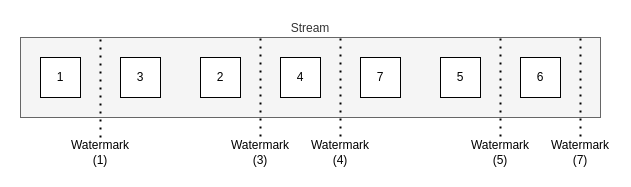

# Reorder by timestamp demo

This demo shows how we can consume from one topic and based on the message sequence, re-order the messages into the sequential order on the output topic.

Instead of using timestamp windows to wait for a specified period or record timestamp to occur, the sample uses the `sequence_number` from the record and only waits until the next contiguous sequence number has been observed before sending to the output stream.

When sending the next sequence number is observed and sent, all other cached records which are contiguous will also be forwarded to the output topic.  This ensures that the code only waits the minimum amount of time as possible before sending the records.

This is achieved by keeping a record of the highest observed `sequence_number`, called the `watermark` on a per key basis.

Both the records to be forwarded and the watermark are both retained using Kafka Streams `StateStore` which ensure fault tolerance in the event of application restarts.



## Running the sample

To run the sample you will require a running Kafka cluster.

To start a working Kafka cluster in Docker for use with this sample, you can use the following command:
```shell
docker compose -f docker.yml up -d
```

First we need to create the input and output topic in Kafka:
```shell
docker run --rm --network kafka-streams-reorder-sequence_kafka-net -it bitnami/kafka:3.5 bash 
$ /opt/bitnami/kafka/bin/kafka-topics.sh --bootstrap-server=kafka-streams-reorder-sequence-kafka-1:9092 --create --topic reorder-seq-input-topic
$ /opt/bitnami/kafka/bin/kafka-topics.sh --bootstrap-server=kafka-streams-reorder-sequence-kafka-1:9092 --create --topic reorder-seq-output-topic
exit
```

Next we need to populate a topic with some messages to be consumed by the application.  These messages should be added
with sequence numbers that are not in order.  
_Note: We use multiple keys to test that `watermarks` are counted on a per key basis._
```shell
docker run --rm -it --network kafka-streams-reorder-sequence_kafka-net confluentinc/cp-schema-registry:7.4.0 bash

$ kafka-avro-console-producer \
--broker-list kafka-streams-reorder-sequence-kafka-1:9092 \
--topic reorder-seq-input-topic \
--property value.schema='{"namespace": "org.example.avro", "type": "record", "name": "ElectronicOrder", "fields": [{"name": "order_id", "type": "string" }, {"name": "sequence_number", "type": "long" }, {"name": "electronic_id", "type": "string" }, {"name": "user_id", "type": "string" }, {"name": "price", "type": "double", "default": 0.0 }, {"name": "time", "type": "long" } ] }' \
--property schema.registry.url=http://kafka-streams-reorder-sequence-schema-registry-1:8081 \
--property "parse.key=true" \
--property "key.separator=:" \
--property "key.serializer=org.apache.kafka.common.serialization.StringSerializer"

10261998 : {"order_id": "instore-1", "sequence_number": 1, "electronic_id": "HDTV-2333", "user_id": "10261998", "price": 2000.0, "time": 1635980400000 }
10261998 : {"order_id": "instore-1", "sequence_number": 3, "electronic_id": "HDTV-2333", "user_id": "10261998", "price": 1999.23, "time": 1635988200000 }
10261998 : {"order_id": "instore-1", "sequence_number": 2, "electronic_id": "HDTV-2333", "user_id": "10261998", "price": 4500.0, "time": 1635987900000 }
10261998 : {"order_id": "instore-1", "sequence_number": 4, "electronic_id": "HDTV-2333", "user_id": "10261998", "price": 1333.98, "time": 1635990000000 }
13245635 : {"order_id": "instore-1", "sequence_number": 1, "electronic_id": "HDTV-2333", "user_id": "13245635", "price": 1345.55, "time": 1635992800000 }
13245635 : {"order_id": "instore-1", "sequence_number": 4, "electronic_id": "HDTV-2333", "user_id": "13245635", "price": 5333.98, "time": 1635994800000 }
13245635 : {"order_id": "instore-1", "sequence_number": 3, "electronic_id": "HDTV-2333", "user_id": "13245635", "price": 4333.98, "time": 1635993600000 }
13245635 : {"order_id": "instore-1", "sequence_number": 2, "electronic_id": "HDTV-2333", "user_id": "13245635", "price": 2234.12, "time": 1635993100000 }
```

Once you have some data on the input stream you can start the Kafka stream application to start processing the streaming data.
```shell
mvn clean package
java -cp target/kafka-streams-reorder-sequence-1.0.0-SNAPSHOT-jar-with-dependencies.jar org.example.Application configuration/dev.properties
```

To view the reordered messages on the output topic, start another instance of Kafka client and run the following command:
```shell
docker run \
  --rm \
  --network kafka-streams-reorder-sequence_kafka-net \
  confluentinc/cp-schema-registry:7.4.0 \
  kafka-avro-console-consumer \
  --bootstrap-server kafka-streams-reorder-sequence-kafka-1:9092 \
  --topic reorder-seq-output-topic \
  --from-beginning \
  --property schema.registry.url=http://kafka-streams-reorder-sequence-schema-registry-1:8081
...
{"order_id":"instore-1","sequence_number":1,"electronic_id":"HDTV-2333","user_id":"10261998","price":2000.0,"time":1635980400000}
{"order_id":"instore-1","sequence_number":2,"electronic_id":"HDTV-2333","user_id":"10261998","price":4500.0,"time":1635987900000}
{"order_id":"instore-1","sequence_number":3,"electronic_id":"HDTV-2333","user_id":"10261998","price":1999.23,"time":1635988200000}
{"order_id":"instore-1","sequence_number":4,"electronic_id":"HDTV-2333","user_id":"10261998","price":1333.98,"time":1635990000000}
{"order_id":"instore-1","sequence_number":1,"electronic_id":"HDTV-2333","user_id":"13245635","price":1345.55,"time":1635992800000}
{"order_id":"instore-1","sequence_number":2,"electronic_id":"HDTV-2333","user_id":"13245635","price":2234.12,"time":1635993100000}
{"order_id":"instore-1","sequence_number":3,"electronic_id":"HDTV-2333","user_id":"13245635","price":4333.98,"time":1635993600000}
{"order_id":"instore-1","sequence_number":4,"electronic_id":"HDTV-2333","user_id":"13245635","price":5333.98,"time":1635994800000}
```

To clean up all resources after the tests, run the following command:
```shell
docker compose -f docker.yml down -v
```